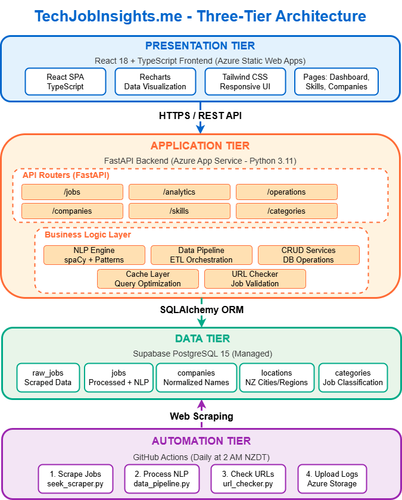
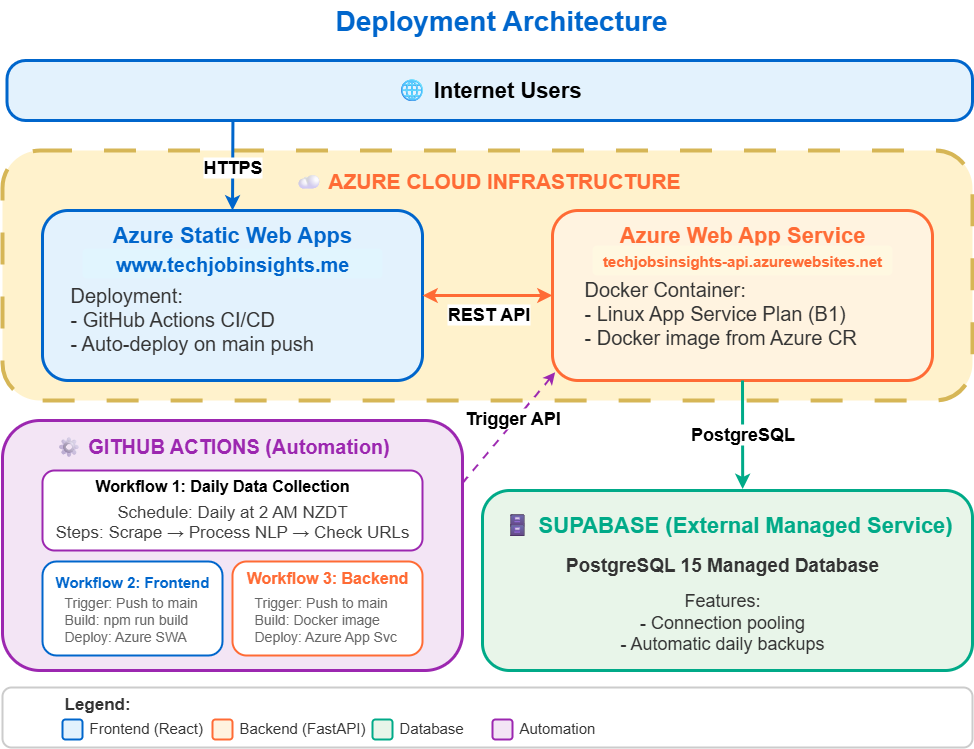
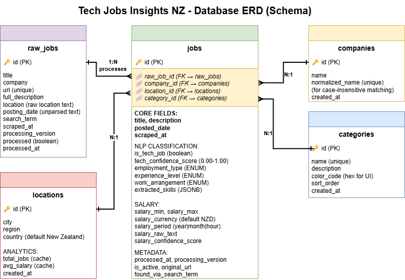

# NZ Tech Jobs Market Intelligence Platform

> **COMP693 Industrial Project - Lincoln University**  
> A comprehensive job market analytics platform for the New Zealand tech industry

## Project Overview

**NZ Tech Jobs Market Intelligence** is a full-stack web application that aggregates, analyzes, and visualizes technology job postings from across New Zealand. The platform provides data-driven insights to help developers, recruiters, and employers make informed decisions about the tech job market.

### Key Features

-   **Intelligent Job Scraping**: Automated collection from Seek.co.nz with advanced parsing
-   **AI-Powered NLP Processing**: spaCy-based text analysis for skill extraction and job classification (90+ tech skills)
-   **Real-time Analytics Dashboard**: Interactive visualizations of market trends and statistics
-   **Skills Intelligence**: Track trending technologies, compare skills, and analyze demand patterns
-   **Regional Insights**: Comprehensive analysis of job markets across New Zealand regions
-   **Company Insights**: Company hiring patterns and job posting analysis
-   **Salary Analytics**: Salary ranges and compensation insights
-   **Multi-Skill Comparison**: Compare up to 3 skills side-by-side with detailed analytics
-   **Tracked Keywords Transparency**: View all monitored skills and search terms
-   **Automated Daily Updates**: GitHub Actions workflow for fresh data (2 AM NZDT)
-   **Modern UI/UX**: Responsive React interface with Tailwind CSS and dark mode support

### Architecture Overview

The platform follows a modern three-tier architecture with automated data collection:

#### System Architecture



The system consists of four main tiers:
- **Presentation Tier**: React 18 + TypeScript frontend with Recharts visualizations
- **Application Tier**: FastAPI backend with NLP processing and business logic
- **Data Tier**: Supabase PostgreSQL database with normalized schema
- **Automation Tier**: GitHub Actions for daily job scraping and processing

#### Deployment Architecture



The application is deployed on Azure Cloud Infrastructure:
- **Frontend**: Azure Static Web Apps (www.techjobinsights.me)
- **Backend**: Azure Web App Service (Docker container)
- **Database**: Supabase PostgreSQL 15 (managed service)
- **Automation**: GitHub Actions workflows for CI/CD and daily updates

## Technology Stack

### Backend

-   **Framework**: FastAPI 0.104.1 (Python 3.11+)
-   **Database**: PostgreSQL 17 (Docker containerized)
-   **ORM**: SQLAlchemy 2.0.23 with Alembic migrations
-   **NLP**: spaCy 3.8.7 with en_core_web_sm model
-   **Web Scraping**: BeautifulSoup4 4.12.2 + Requests
-   **Data Processing**: Python-dateutil, pytz

### Frontend

-   **Framework**: React 19.1 + TypeScript 5.8
-   **Build Tool**: Vite 5.4
-   **Routing**: React Router DOM 7.8
-   **HTTP Client**: Axios 1.7
-   **State Management**: Zustand 5.0, TanStack React Query 5.87
-   **UI Components**: Headless UI 2.2, Heroicons 2.2, Lucide React 0.542
-   **Styling**: Tailwind CSS 3.4 with PostCSS
-   **Charts & Visualization**: Recharts 3.2, React Three Fiber, Framer Motion 12.23
-   **Testing**: Vitest 1.6, Testing Library, Axios Mock Adapter

### Infrastructure & DevOps

-   **Containerization**: Docker + Docker Compose
-   **Database Versioning**: Alembic migrations
-   **Development**: Hot reload (Vite + Uvicorn)
-   **API Documentation**: OpenAPI/Swagger (auto-generated)
-   **Deployment**: Azure Web App Service, Azure Static Web Apps, Supabase
-   **Automation**: GitHub Actions for daily data updates

### Automation

-   **Daily Updates**: Automated job scraping and processing at 2 AM NZDT
-   **Workflow**: GitHub Actions orchestrating API calls
-   **Monitoring**: Comprehensive logging and status tracking
-   **Cost**: $0 additional infrastructure (uses GitHub Actions free tier)

> See [AUTOMATION_SUMMARY.md](AUTOMATION_SUMMARY.md) for complete automation documentation

## Quick Start Guide

### Prerequisites

```
- Python 3.11+
- Node.js 18+
- Docker Desktop
- Git
```

### 1. Clone the Repository

```bash
# Clone the repository
git clone https://github.com/COMP693-Projects-25S2/COMP693_25S2_project__Tan_1162169.git

# Navigate to project directory
cd COMP693_25S2_project__Tan_1162169
```

### 2. Backend Setup

#### Option A: Docker (Recommended)

```bash
# Start PostgreSQL database
docker-compose up -d database

# Build and start backend
docker-compose up -d backend

# Initialize database schema
docker-compose exec backend python -c "
from app.database import Base, engine
Base.metadata.create_all(bind=engine)
print('✅ Database initialized')
"
```

#### Option B: Local Development

```bash
cd backend

# Create virtual environment
python -m venv venv
source venv/bin/activate  # Windows: venv\Scripts\activate

# Install dependencies
pip install -r requirements.txt

# Download spaCy model
python -m spacy download en_core_web_sm

# Start database only
docker-compose up -d database

# Initialize database
python -c "
from app.database import Base, engine
Base.metadata.create_all(bind=engine)
"

# Start API server
uvicorn app.main:app --reload --port 8000
```

### 3. Frontend Setup

```bash
cd frontend

# Install dependencies
npm install

# Start development server
npm run dev
```

### 4. Access the Application

-   **Frontend**: http://localhost:3000
-   **Backend API**: http://localhost:8000
-   **API Docs**: http://localhost:8000/docs
-   **Database**: localhost:5432 (postgres/password)

### 5. Production Deployment

-   **Frontend**: https://www.techjobinsights.me
-   **Backend API**: https://techjobsinsights-api-a6gxgsffa9dtaad3.newzealandnorth-01.azurewebsites.net
-   **Database**: Supabase PostgreSQL 15 (managed)

## Project Structure

```
COMP693_25S2_project__Tan_1162169/
│
├── backend/                      # Python FastAPI Backend
│   ├── app/                      # Main application code
│   │   ├── models/              # SQLAlchemy ORM models
│   │   │   ├── tables.py        # Database table definitions
│   │   │   └── enums.py         # Enum types (employment, experience, etc.)
│   │   ├── routers/             # API endpoint handlers
│   │   │   ├── jobs.py          # Job listings endpoints
│   │   │   ├── skills.py        # Skills analytics endpoints
│   │   │   ├── analytics.py     # Dashboard & analytics
│   │   │   ├── companies.py     # Company endpoints
│   │   │   ├── categories.py    # Job categories
│   │   │   ├── regions.py       # Regional insights
│   │   │   └── operations.py    # Automation endpoints
│   │   ├── processors/          # Data processing pipeline
│   │   │   ├── nlp_engine.py    # spaCy NLP processing
│   │   │   ├── data_pipeline.py # Job processing pipeline
│   │   │   └── url_checker.py   # URL validation
│   │   ├── scrapers/            # Web scraping modules
│   │   │   ├── base_scraper.py  # Base scraper class
│   │   │   └── seek_scraper.py  # Seek.co.nz scraper
│   │   ├── core/                # Core utilities
│   │   │   ├── config.py        # Configuration management
│   │   │   └── logging.py       # Logging setup
│   │   ├── database.py          # Database connection & session
│   │   ├── schemas.py           # Pydantic models
│   │   ├── crud.py              # Database operations
│   │   └── main.py              # FastAPI application
│   │
│   ├── database/                # Database management
│   │   ├── schema/              # Schema initialization
│   │   ├── operations/          # Data pipelines
│   │   ├── maintenance/         # Validation scripts
│   │   └── docs/                # Database documentation
│   │
│   ├── scripts/                 # Utility scripts
│   │   ├── collection/          # Data collection scripts
│   │   └── migrations/          # Database migrations
│   │
│   ├── alembic/                 # Database migrations
│   │   └── versions/            # Migration files
│   │
│   ├── requirements.txt         # Python dependencies
│   ├── Dockerfile               # Backend container
│   └── alembic.ini             # Alembic configuration
│
├── frontend/                    # React TypeScript Frontend
│   ├── src/
│   │   ├── pages/              # Page components
│   │   │   ├── Dashboard.tsx   # Main dashboard
│   │   │   ├── Skills.tsx      # Skills analytics
│   │   │   ├── SkillDetail.tsx # Skill details
│   │   │   ├── SkillComparison.tsx # Multi-skill comparison
│   │   │   ├── Companies.tsx   # Companies list
│   │   │   ├── CompanyDetail.tsx # Company details
│   │   │   ├── Regions.tsx     # Regional insights
│   │   │   ├── RegionDetail.tsx # Region details
│   │   │   ├── TrackedKeywords.tsx # Skills taxonomy
│   │   │   └── About.tsx       # About page
│   │   ├── components/         # Reusable components
│   │   │   ├── layout/         # Layout components
│   │   │   ├── common/         # Common UI components
│   │   │   │   ├── GlassCard.tsx # Glass morphism cards
│   │   │   │   ├── SkillBadge.tsx # Skill badges
│   │   │   │   └── SkillMultiSelect.tsx # Multi-select
│   │   │   ├── charts/         # Chart components
│   │   │   └── dashboard/      # Dashboard widgets
│   │   ├── services/           # API service layer
│   │   │   ├── api.ts          # Base API client
│   │   │   ├── dashboardService.ts
│   │   │   ├── skillsService.ts
│   │   │   ├── companiesService.ts
│   │   │   ├── regionsService.ts
│   │   │   └── trackedKeywordsService.ts
│   │   ├── types/              # TypeScript types
│   │   ├── hooks/              # Custom React hooks
│   │   ├── utils/              # Utility functions
│   │   ├── App.tsx             # Main app component
│   │   └── main.tsx            # Entry point
│   │
│   ├── tests/                  # Frontend tests
│   ├── package.json            # Node dependencies
│   ├── vite.config.ts          # Vite configuration
│   └── tsconfig.json           # TypeScript config
│
├── ERD/                         # Database diagrams
│   ├── Current_Database_ERD.drawio
│   ├── database_erd.mmd
│   └── README.md
│
├── docker-compose.yml           # Docker orchestration
└── README.md                    # This file
```

## Database Schema

### Entity Relationship Diagram



The database follows a normalized relational schema with the following structure:

### Core Tables

#### 1. raw_jobs (Raw Data Layer)

-   Stores unprocessed scraped job listings
-   Fields: title, company, url, full_description, location, posting_date, search_term
-   Tracks processing status with `processed` flag

#### 2. jobs (Processed Data Layer)

-   NLP-processed and structured job data
-   **Key Features**:
    -   `extracted_skills`: JSONB field for flexible skill storage
    -   Enum fields: `employment_type`, `experience_level`, `work_arrangement`
    -   Salary information with confidence scores
    -   Tech job classification with confidence
-   Links to: companies, locations, categories

#### 3. companies

-   Normalized company information
-   Uses `normalized_name` for case-insensitive matching

#### 4. locations

-   Structured location data (city, region, country)
-   Includes job statistics

#### 5. categories

-   Job category classifications
-   UI metadata (color codes, sort order)

### Database Features

-   Two-stage processing pipeline (raw → processed)
-   JSONB for flexible skill storage
-   Enum-based classifications (3NF compliant)
-   Alembic migrations for version control
-   Comprehensive indexes for performance
-   Audit trails with timestamps

## Data Pipeline

### 1. Collection Phase

```python
# scripts/collection/collect_raw_data.py
SeekScraper → raw_jobs table
```

-   Scrapes job listings from Seek.co.nz
-   Stores raw HTML and metadata
-   Handles pagination and rate limiting
-   Duplicate detection via URL

### 2. Processing Phase

```python
# app/processors/data_pipeline.py
raw_jobs → NLP Engine → jobs table
```

-   **NLP Analysis** (spaCy):
    -   Skill extraction (70+ tech skills across 8 categories)
    -   Employment type classification
    -   Experience level detection
    -   Salary parsing with regex
-   **Data Normalization**:
    -   Company name standardization
    -   Location parsing
    -   Category assignment
-   **Quality Assurance**:
    -   Confidence scoring
    -   Tech job validation
    -   URL accessibility checks (optional)

### 3. Analytics Generation

```python
# app/routers/analytics.py
jobs table → Aggregations → API responses
```

-   Real-time statistics calculation
-   Trend analysis
-   Skill popularity rankings
-   Company hiring patterns

## API Endpoints

### Jobs

```
GET    /api/v1/jobs              # List jobs (paginated, filterable)
GET    /api/v1/jobs/{id}         # Job details
POST   /api/v1/jobs              # Create job (admin)
PUT    /api/v1/jobs/{id}         # Update job
```

### Skills

```
GET    /api/v1/skills                      # List all skills
GET    /api/v1/skills/popular              # Popular skills
GET    /api/v1/skills/{name}               # Skill details
GET    /api/v1/skills/{name}/jobs          # Jobs requiring skill
GET    /api/v1/skills/compare              # Compare skills
```

### Analytics

```
GET    /api/v1/analytics/dashboard         # Dashboard stats
GET    /api/v1/analytics/trending-skills   # Trending skills
GET    /api/v1/analytics/popular-companies # Top hiring companies
GET    /api/v1/analytics/skill-trends      # Skill trend data
```

### Companies

```
GET    /api/v1/companies           # List companies
GET    /api/v1/companies/{id}      # Company details
GET    /api/v1/companies/{id}/jobs # Company jobs
```

### Categories

```
GET    /api/v1/categories          # List categories
```

### Regions

```
GET    /api/v1/regions/with-stats             # List regions with statistics
GET    /api/v1/regions/{location_id}/details  # Region details
GET    /api/v1/regions/{location_id}/jobs     # Jobs in region
GET    /api/v1/regions/{location_id}/skills   # Top skills in region
GET    /api/v1/regions/{location_id}/companies # Top companies in region
```

### Operations (Automation)

```
POST   /api/v1/operations/daily-update   # Run complete daily update
POST   /api/v1/operations/scrape         # Scrape new jobs
POST   /api/v1/operations/process-nlp    # Process jobs with NLP
POST   /api/v1/operations/check-urls     # Check job URL validity
GET    /api/v1/operations/verify-data    # Verify data quality
GET    /api/v1/operations/status         # System status
```

## Frontend Features

### Pages

1. **Dashboard** (`/`)

    - Market overview statistics
    - Trending skills widget
    - Recent jobs feed
    - Popular companies
    - Interactive charts

2. **Skills Analytics** (`/skills`)

    - Skill popularity rankings
    - Category filtering
    - Job count per skill
    - Growth trends
    - Time-based filtering

3. **Skill Detail** (`/skills/:skillName`)

    - Skill-specific statistics
    - Related jobs
    - Salary insights
    - Related skills
    - Historical trends

4. **Skill Comparison** (`/skills/compare`)

    - Side-by-side skill comparison
    - Demand trends visualization
    - Salary comparisons
    - Top hiring companies per skill
    - Compare up to 3 skills simultaneously

5. **Companies** (`/companies`)

    - Company listings
    - Hiring activity
    - Job counts
    - Search and filtering

6. **Company Detail** (`/companies/:id`)

    - Company profile
    - Active job postings
    - Hiring patterns
    - Skill requirements

7. **Regional Insights** (`/regions`)

    - NZ regional job market analysis
    - Jobs by city and region
    - Regional salary trends
    - Top companies per region
    - Skill filtering by region

8. **Region Detail** (`/regions/:id`)

    - Region-specific statistics
    - Top skills in demand
    - Major employers
    - Salary ranges
    - Job growth trends

9. **Tracked Keywords** (`/tracked-keywords`)

    - Skills taxonomy transparency
    - Search terms used for scraping
    - Skills categorization
    - Data collection methodology
    - 90+ monitored tech skills

10. **About** (`/about`)
    - Platform information
    - Project methodology
    - Technology stack
    - Data sources

### UI Features

-   Dark/Light mode toggle
-   Fully responsive design
-   Real-time search and filtering
-   Interactive charts (Recharts)
-   Smooth animations (Framer Motion)
-   Accessibility features

## Testing

### Backend Tests

```bash
cd backend
pytest
```

### Frontend Tests

```bash
cd frontend
npm test              # Run tests
npm run test:ui       # Interactive UI
npm run test:coverage # Coverage report
```

## Data Collection

### Manual Scraping

```bash
cd backend

# Collect raw jobs
python scripts/collection/collect_raw_data.py

# Process collected jobs
python -c "
from app.database import SessionLocal
from app.processors.data_pipeline import DataProcessingPipeline

db = SessionLocal()
pipeline = DataProcessingPipeline()
stats = pipeline.process_unprocessed_jobs()
print(f'Processed {stats.processed_jobs} jobs')
"
```

### Automated Operations

#### Via API Endpoints (Recommended for Production)

The platform provides REST API endpoints for all automation tasks:

```bash
# Trigger complete daily update via API
curl -X POST https://techjobsinsights-api-a6gxgsffa9dtaad3.newzealandnorth-01.azurewebsites.net/api/v1/operations/daily-update

# Or run individual operations
curl -X POST .../api/v1/operations/scrape          # Scrape new jobs
curl -X POST .../api/v1/operations/process-nlp     # Process with NLP
curl -X POST .../api/v1/operations/check-urls      # Verify job URLs
curl -X GET  .../api/v1/operations/status          # Check system status
```

#### Via GitHub Actions (Production)

The platform runs automated daily updates at 2 AM NZDT:

```bash
# Manually trigger workflow (with GitHub CLI)
gh workflow run daily-update.yml

# View workflow runs
gh run list --workflow=daily-update.yml
```

#### Local Python Scripts

```bash
# Run complete daily update
python backend/database/operations/daily_update.py

# Or run steps individually
python backend/database/operations/incremental_scrape.py  # Collect new jobs
python backend/database/operations/run_nlp_pipeline.py    # Process jobs
```

## Key Implementation Details

### NLP Engine

The `nlp_engine.py` module provides:

-   **90+ Tech Skills** across 9 categories:
    -   **Programming Languages**: Python, JavaScript, Java, C#, C++, TypeScript, PHP, Ruby, Go, Rust, Scala, Kotlin, Swift, R, Perl
    -   **Web Frameworks**: React, Angular, Vue.js, Django, Flask, FastAPI, Spring, Laravel, Rails, Express.js, Node.js, ASP.NET, Next.js, Svelte
    -   **Databases**: PostgreSQL, MySQL, MongoDB, Redis, Elasticsearch, SQL Server, Oracle, Cassandra, DynamoDB, Neo4j, MariaDB, Cosmos DB
    -   **Cloud Platforms**: AWS, Azure, GCP, Google Cloud, DigitalOcean, Heroku, Vercel, Netlify, Cloudflare, Firebase
    -   **DevOps Tools**: Docker, Kubernetes, Jenkins, GitLab, GitHub Actions, Terraform, Ansible, Chef, Puppet, Helm, Prometheus, Grafana
    -   **AI/ML**: TensorFlow, PyTorch, Machine Learning, Deep Learning, NLP, Computer Vision, Pandas, NumPy, scikit-learn, LLM, Data Science
    -   **Mobile Development**: iOS, Android, React Native, Flutter, Xamarin, Swift, Kotlin
    -   **Testing Tools**: Selenium, Cypress, Jest, JUnit, Pytest, Mocha, Postman, JMeter, Cucumber, Appium
    -   **Tools & Methodologies**: Git, Linux, Bash, PowerShell, REST API, GraphQL, Microservices, Agile, Scrum, Jira, Webpack
-   **Advanced Parsing**:
    -   Salary extraction with confidence scores
    -   Employment type classification
    -   Experience level detection
    -   Work arrangement identification
    -   Location normalization

### Web Scraper

The `seek_scraper.py` implements:

-   **Multi-page scraping** with pagination support
-   **Both normal and premium job cards** extraction
-   **Rate limiting** and respectful scraping practices
-   **Duplicate detection** via URL comparison
-   **Comprehensive search terms** (40+ tech-related search terms)
-   **Detailed metadata** extraction (title, company, location, salary, description)
-   **Error handling** and retry logic
-   **Async support** for large scraping operations

### Database Management

-   **Alembic migrations** for schema versioning
-   **Two-stage pipeline**: raw_jobs → jobs
-   **JSONB skill storage** for flexibility
-   **Normalized relationships** (3NF)
-   **Strategic indexes** for performance

## Common Issues & Solutions

### Backend Issues

**Issue**: spaCy model not found

```bash
python -m spacy download en_core_web_sm
```

**Issue**: Database connection refused

```bash
# Ensure database is running
docker-compose ps
docker-compose up -d database
```

**Issue**: Alembic migration conflicts

```bash
cd backend
alembic stamp head  # Reset migration state
```

### Frontend Issues

**Issue**: Module not found

```bash
cd frontend
rm -rf node_modules package-lock.json
npm install
```

**Issue**: Port already in use

```bash
# Change port in vite.config.ts or kill process
lsof -ti:5173 | xargs kill -9  # Unix
netstat -ano | findstr :5173   # Windows
```

## Performance Metrics

### Backend Performance

-   **API Response Time**: < 100ms (average)
-   **Job Processing**: ~2-3 seconds per job (NLP included)
-   **Scraping Speed**: ~1 second per job listing
-   **Database Queries**: Optimized with indexes

### Frontend Performance

-   **Initial Load**: < 2 seconds
-   **Page Transitions**: < 500ms
-   **Chart Rendering**: < 300ms
-   **Lighthouse Score**: 90+ (Performance)

## Security Considerations

-   No authentication required (public data)
-   CORS configured for frontend access
-   SQL injection prevention (SQLAlchemy ORM)
-   Rate limiting on scraper
-   Environment variables for sensitive config
-   Future: Add rate limiting to API endpoints
-   Future: Implement API key authentication

## Implemented Features (v1.0)

### Core Functionality ✅

-   [x] Intelligent job scraping from Seek NZ
-   [x] NLP-powered skill extraction (90+ tech skills)
-   [x] Real-time analytics dashboard
-   [x] Multi-skill comparison tool
-   [x] Regional insights across NZ
-   [x] Company hiring patterns analysis
-   [x] Skills taxonomy transparency
-   [x] Automated daily updates (GitHub Actions)
-   [x] CI/CD deployment to Azure
-   [x] Production deployment (Supabase + Azure)
-   [x] Responsive dark/light mode UI
-   [x] Time-based filtering (30/60/90 days)

## Future Enhancements

### Phase 2 Features

-   [ ] User accounts and saved searches
-   [ ] Email job alerts and notifications
-   [ ] Salary trend predictions (ML)
-   [ ] Resume matching and recommendations
-   [ ] More job sources (Indeed, LinkedIn)
-   [ ] Mobile app (React Native)
-   [ ] Employer dashboard and analytics
-   [ ] Advanced job search with filters
-   [ ] Career path recommendations

### Technical Improvements

-   [ ] Redis caching layer for performance
-   [ ] Celery task queue for background jobs
-   [ ] Elasticsearch for advanced full-text search
-   [ ] GraphQL API endpoint
-   [ ] Real-time WebSocket updates
-   [ ] Kubernetes deployment
-   [ ] API rate limiting
-   [ ] Advanced monitoring and alerting

## Documentation

### Project Documentation

-   **Main Documentation**:
    -   `README.md` (this file) - Complete project overview
    -   `backend/README.md` - Backend development guide
    -   `frontend/README.md` - Frontend development guide

### Architecture & Design

-   **ERD & Diagrams**:
    -   `ERD/README.md` - Start here for architecture diagrams
    -   `ERD/START_HERE.md` - Quick guide to diagrams
    -   `ERD/ARCHITECTURE_SUMMARY.md` - Complete architecture documentation
    -   `ERD/HOW_TO_USE_IN_REPORT.md` - Using diagrams in reports
    -   Database ERD, System Architecture, Deployment Architecture (PNG files)

### Database & Backend

-   **Database**:
    -   `backend/database/README.md` - Database management guide
    -   `backend/database/docs/` - Detailed database documentation
    -   `backend/database/deployment/` - Deployment guides (Supabase)
    -   `backend/database/maintenance/` - Maintenance scripts

-   **Backend Development**:
    -   `backend/docs/AUTOMATION.md` - Automation system details
    -   `backend/docs/AUTOMATION_SETUP.md` - Setup automation
    -   `backend/docs/DATABASE.md` - Database guide
    -   `backend/docs/FILE_ORGANIZATION.md` - Backend structure

### Automation & CI/CD

-   **GitHub Actions**:
    -   `.github/GITHUB_ACTIONS_SETUP_GUIDE.md` - Complete setup guide
    -   `.github/HOW_IT_WORKS.md` - Workflow explanation
    -   `.github/QUICK_SECRETS_SETUP.md` - Quick secrets configuration
    -   `AUTOMATION_SUMMARY.md` - Daily automation overview

### Implementation Summaries

-   `REGIONAL_INSIGHTS_IMPLEMENTATION_SUMMARY.md` - Regional features
-   `TRACKED_KEYWORDS_IMPLEMENTATION.md` - Skills taxonomy
-   `SKILLCOMPARISON_FIX_SUMMARY.md` - Skill comparison feature
-   `COMPANIES_PAGE_IMPROVEMENTS.md` - Companies page updates
-   `TAILWIND_MIGRATION_COMPLETE.md` - Frontend styling update

## Contributing

### Development Workflow

1. Create a feature branch
2. Make changes with clear commits
3. Write/update tests
4. Update documentation
5. Create pull request

### Code Style

-   **Python**: PEP 8, type hints
-   **TypeScript**: ESLint rules
-   **Git**: Conventional commits

## License

This project is part of COMP693 Industrial Project at Lincoln University.  
© 2025 - For educational purposes.

## Developer

**Student**: Tan  
**Student ID**: 1162169  
**Course**: COMP693 Industrial Project (25S2)  
**Institution**: Lincoln University, New Zealand

## Support

For questions or issues:

1. Check documentation in `/docs` folders and `ERD/` directory
2. Review common issues section above
3. Check API documentation at `/docs` endpoint (http://localhost:8000/docs)
4. Review implementation summaries in root directory
5. View GitHub Actions logs for automation issues
6. Check `.github/` directory for workflow documentation

**Repository**: https://github.com/COMP693-Projects-25S2/COMP693_25S2_project__Tan_1162169

## Acknowledgments

-   **spaCy** - Natural language processing engine
-   **FastAPI** - Modern Python web framework
-   **React** - Frontend framework
-   **PostgreSQL** - Reliable database system
-   **Azure** - Cloud hosting infrastructure (Static Web Apps, App Service)
-   **Supabase** - Managed PostgreSQL database hosting
-   **GitHub Actions** - CI/CD and automation platform
-   **Tailwind CSS** - Utility-first CSS framework
-   **Recharts** - React charting library
-   **Seek.co.nz** - Primary job data source
-   **Lincoln University** - Educational support and guidance

---

**Last Updated**: January 2025  
**Version**: 1.0.0 (Production)  
**Status**: Live & Operational

**Deployment**:
- Frontend: Azure Static Web Apps (www.techjobinsights.me)
- Backend: Azure Web App Service (Docker)
- Database: Supabase PostgreSQL 15
- Automation: GitHub Actions (Daily at 2 AM NZDT)
